# Diagramme d'Architecture - CFTravel

## Architecture Globale

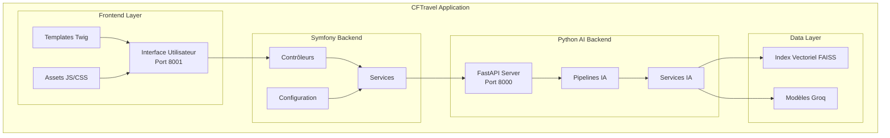

## Flux de Données

### 1. Flux de Chat Utilisateur

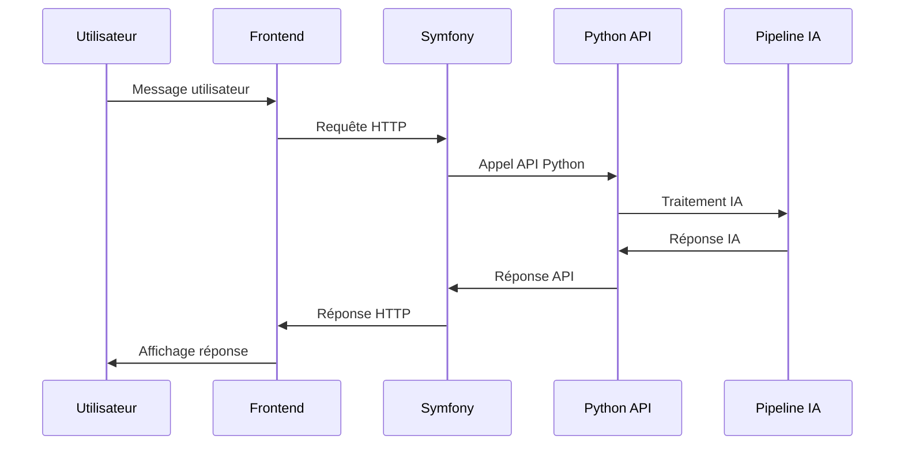

### 2. Flux de Recherche Sémantique

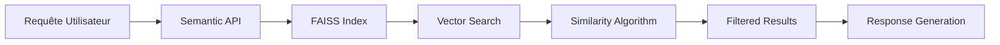

## Architecture des Composants

### Backend Symfony

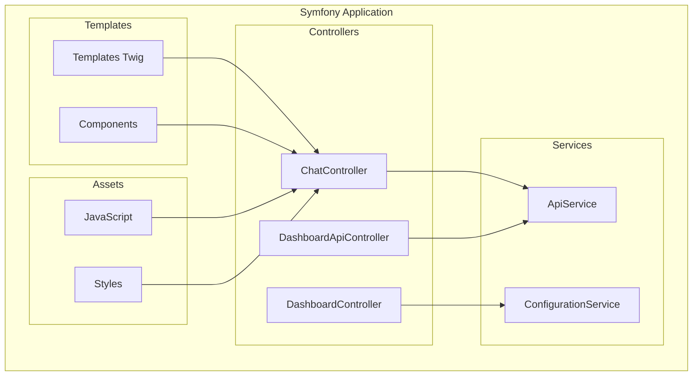

### Backend Python IA

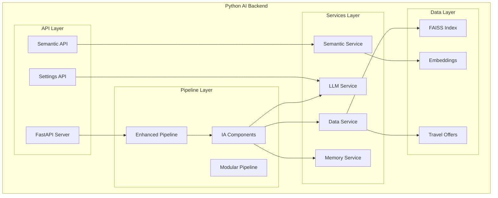

## Pipeline IA Détaillé

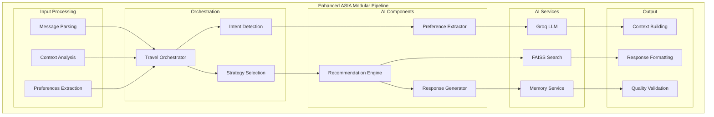

## Architecture Frontend

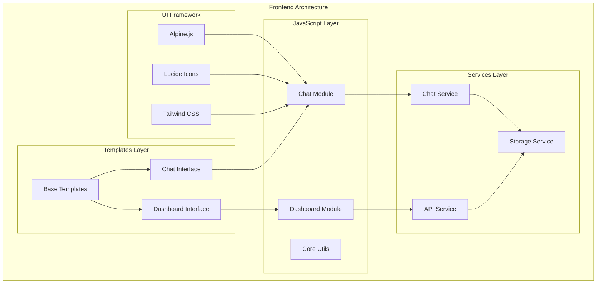

## Points d'Intégration

### Communication Symfony ↔ Python

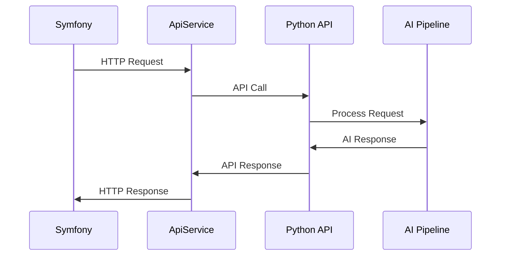

### Flux de Données Vectorielles

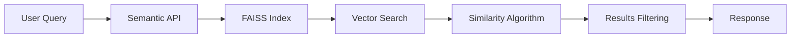

## Sécurité et Performance

### Architecture de Sécurité

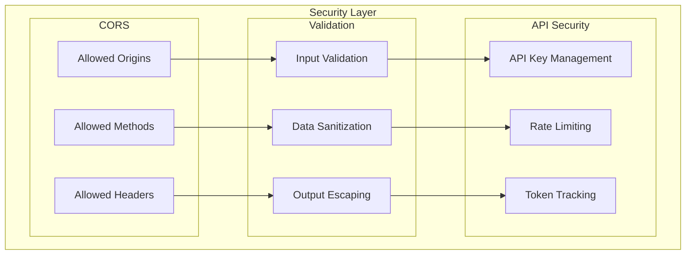

### Optimisations de Performance

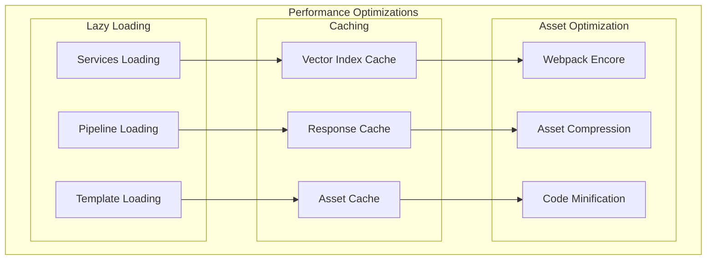

## Modèles IA et Capacités

### Modèles Groq Utilisés

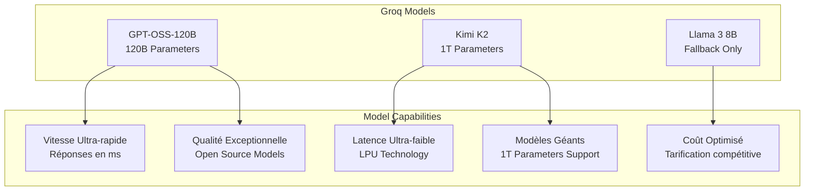

### Choix des Modèles

**GPT-OSS-120B (Modèle Principal)**
- **Capacités** : Modèle open source de 120 milliards de paramètres
- **Contexte** : Large contexte pour les conversations complexes
- **Vitesse** : Réponses ultra-rapides grâce aux LPU de Groq
- **Avantages** : Modèle open source récemment libéré, performances élevées

**Kimi K2 (Modèle Secondaire - 1T Paramètres)**
- **Capacités** : Modèle de 1 trillion de paramètres (1T)
- **Contexte** : Contexte extrêmement large pour l'analyse approfondie
- **Utilisation** : Traitement des requêtes complexes nécessitant une compréhension profonde
- **Avantages** : Modèle le plus puissant disponible, récemment open source
- **Particularité** : Premier modèle de 1T paramètres accessible via API

**Llama 3 8B (Modèle de Fallback)**
- **Capacités** : Modèle léger et rapide
- **Utilisation** : Fallback en cas de problème avec les modèles principaux
- **Avantages** : Fiabilité et stabilité éprouvées

### Avantages de Groq

- **LPU Technology** : Processeurs spécialisés pour le langage
- **Latence Ultra-faible** : Idéal pour les applications interactives
- **Scalabilité** : Infrastructure capable de gérer les modèles de 1T paramètres
- **Modèles Open Source Récents** : GPT-OSS-120B et Kimi K2
- **Support Modèles Géants** : Capacité unique d'exécuter des modèles de 1T paramètres

## Web Scraping et Base de Données

### Processus de Collecte de Données

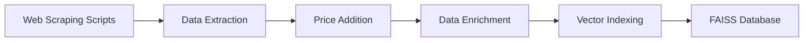

### Scripts de Web Scraping

**Scripts Utilisés :**
- `scripts/scrape_asia_enhanced_auto.py` : Scraping automatique des destinations asiatiques
- `scripts/merge_enhanced_data.py` : Fusion et enrichissement des données

**Technologies de Scraping :**
- **BeautifulSoup4** : Parsing HTML et extraction de contenu
- **Requests** : Requêtes HTTP pour récupérer les pages
- **Pandas** : Traitement et manipulation des données
- **NumPy** : Calculs numériques pour les prix

### Enrichissement des Données

**Ajout des Prix :**
- **Méthode** : Algorithmes de pricing basés sur la destination et la saison
- **Sources** : Données de marché, tendances saisonnières
- **Gamme de Prix** : Budget, moyen, luxe pour chaque destination

**Mise à Jour de la Plage de Données :**
- **Destinations** : Focus sur l'Asie avec données enrichies
- **Informations** : Descriptions détaillées, conseils pratiques
- **Métadonnées** : Tags, catégories, popularité

### Structure des Données Vectorisées

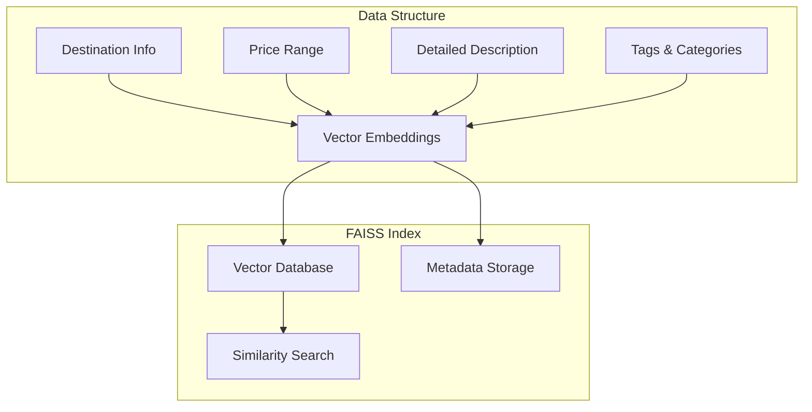

### Avantages de l'Approche

**Données Enrichies :**
- Informations complètes sur chaque destination
- Prix réalistes et à jour
- Conseils pratiques et culturels

**Recherche Sémantique Avancée :**
- Compréhension des préférences utilisateur
- Recommandations personnalisées
- Correspondance intelligente des offres

**Performance Optimisée :**
- Index vectoriel FAISS pour recherche rapide
- Métadonnées structurées pour filtrage
- Mise à jour automatique des données 