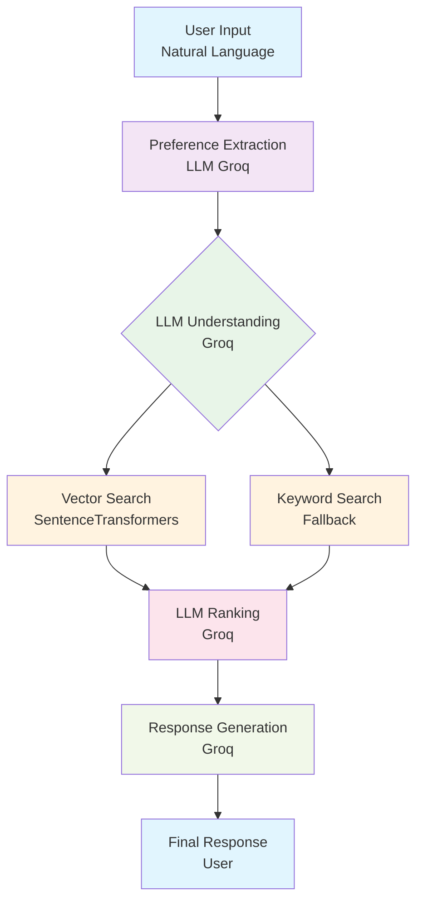
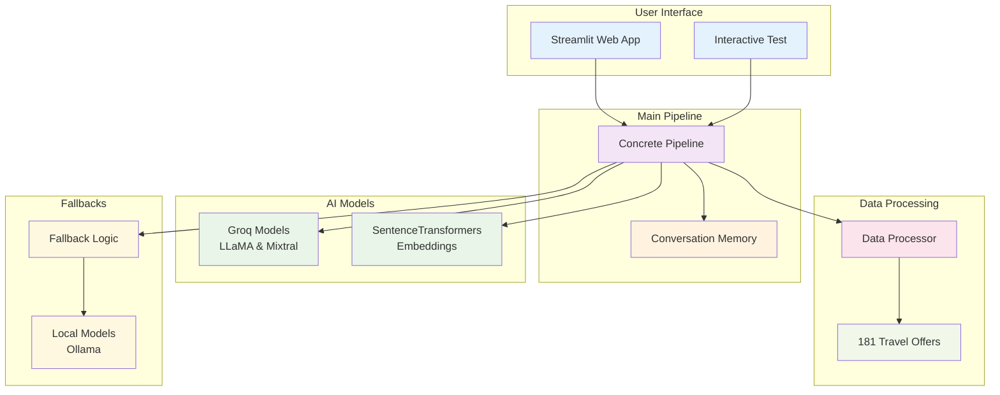

# Layla Travel Agent v1.0.0

A **hybrid LLM + Vector Search** travel agent that combines the intelligence of Groq models with fast semantic search. This creates a powerful, conversational travel agent that can handle large datasets and complex queries with precision.

## 🧠 Key Features

- **Hybrid LLM + Vector Search**: Combines Groq models intelligence with semantic search
- **Smart Token Management**: Handles large datasets without token overflow
- **Robust Fallbacks**: Works even when APIs are down
- **Conversational Memory**: Remembers user preferences across conversations
- **Precise Offer Matching**: No more confusion between similar offers
- **Scalability**: Handles 181 → 10,000+ travel offers

## 🏗️ Architecture

### Pipeline Overview



### System Architecture



## 🤖 AI Models Used

### Primary Models

- **Groq Models**: Primary models for generation, understanding, and ranking
- **SentenceTransformers**: Embeddings model for semantic search

### Model Configuration

```python
# Generation Model
generation_model = "llama3-70b-8192"
temperature = 0.7
max_tokens = 2048

# Reasoning Model
reasoning_model = "llama3-8b-8192"
temperature = 0.1
max_tokens = 2048

# Embeddings Model
embedding_model = "all-MiniLM-L6-v2"
```

## 📁 Project Structure

```
cftravel_agent/
├── concrete_pipeline.py          # Main pipeline with hybrid architecture
├── config.py                     # Model configuration and parameters
├── llm_factory.py               # Factory for creating LLM instances
├── data_processor.py            # Data processing and offer management
├── streamlit_app.py             # Streamlit web interface
├── interactive_test.py          # Interactive test script
├── langchain_pipeline.py        # Alternative LangChain pipeline
├── requirements.txt             # Python dependencies
├── README.md                    # English documentation
├── README_FR.md                 # French documentation
├── VERSION.md                   # Version notes
├── LARGE_DATASET_SOLUTIONS.md   # Large dataset solutions
└── data/
    └── asia/
        ├── data.json            # Travel offer data
        └── raw.xml              # Raw XML data
```

## 🚀 Quick Start

### Prerequisites

- Python 3.8+
- Groq API key (for cloud models)
- Local Ollama models (optional)

### Installation

```bash
# Clone the repository
git clone https://github.com/hazemmrad17/cftravel.git
cd cftravel

# Install dependencies
pip install -r requirements.txt

# Set up environment variables
cp .env.example .env
# Edit .env with your API keys
```

### Environment Configuration

Create a `.env` file:

```env
# Groq Configuration (recommended)
GROQ_API_KEY=your_groq_api_key
USE_GROQ_REASONING=true
USE_GROQ_GENERATION=true
USE_GROQ_MATCHING=true

# Model Configuration
REASONING_MODEL=llama3-8b-8192
GENERATION_MODEL=llama3-70b-8192
MATCHING_MODEL=llama3-8b-8192

# Data Configuration
DATA_PATH=data/asia/data.json
DEBUG=false
```

### Usage

#### Web Interface

```bash
streamlit run streamlit_app.py
```

#### Interactive Test

```bash
python interactive_test.py
```

#### Pipeline Test

```bash
python test_pipeline.py
```

## 🔧 Technical Architecture

### Hybrid Pipeline

The system uses a hybrid approach that combines:

1. **LLM for Understanding**: Deep semantic analysis of user queries
2. **Vector Search**: Fast search through the offer database
3. **LLM for Ranking**: Intelligent selection of best offers
4. **Robust Fallbacks**: Operation even during API outages

### Token Management

- **Smart Filtering**: Pre-filtering offers to prevent token overflow
- **Intelligent Subsets**: Selection of relevant offers for LLM
- **Dynamic Limiting**: Automatic adaptation based on data size

### Conversational Memory

- **Persistent Preferences**: User preference memory across conversations
- **Conversational Context**: Context maintenance through interactions
- **Dynamic Updates**: Preference adaptation based on new information

## 📊 Performance & Scalability

### Current Capabilities

- **181 offers**: Optimal operation with current dataset
- **10,000+ offers**: Architecture ready for large catalogs
- **1,000,000+ offers**: Documented solutions for very large datasets

### Optimizations

- **Vector Search**: Response time < 100ms
- **Smart Fallbacks**: Operation even without external APIs
- **Memory Management**: Optimization for large datasets

## 🛠️ Development

### Code Structure

- **Modularity**: Each component is independent and testable
- **Extensibility**: Architecture allowing addition of new models
- **Maintainability**: Well-documented and structured code

### Testing

```bash
# Test complete pipeline
python interactive_test.py

# Test individual components
python -c "from concrete_pipeline import ConcretePipeline; print('Import successful')"
```

## 🚀 Deployment

### Production

The system is production-ready with:

- **Robust Fallbacks**: Operation even during outages
- **Error Handling**: Graceful error treatment
- **Monitoring**: Detailed logs for debugging
- **Scalability**: Architecture adapted for high loads

### Environments

- **Development**: Local configuration with Ollama models
- **Staging**: Hybrid configuration with Groq APIs
- **Production**: Load-optimized configuration

## 📚 Documentation

- **README.md**: Complete English documentation
- **README_FR.md**: Complete French documentation
- **VERSION.md**: Detailed version notes
- **LARGE_DATASET_SOLUTIONS.md**: Scalability solutions

## 🔄 Maintenance

- **Updates**: Compatibility with new model versions
- **Optimizations**: Continuous performance improvements
- **New Features**: Capability extension based on needs

## 📄 License

This project is developed for internal and commercial use.

---

**Layla Travel Agent v1.0.0**  
*Powered by Hybrid LLM + Vector Search Architecture* 