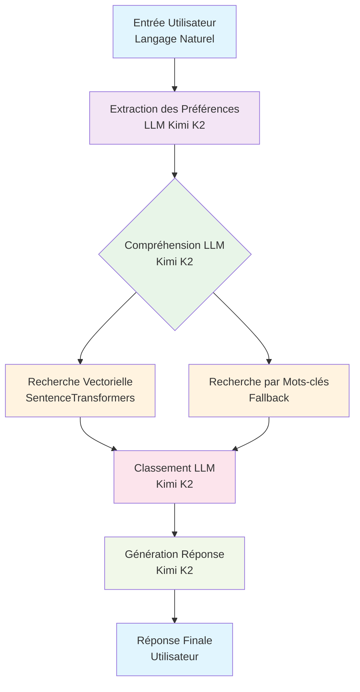
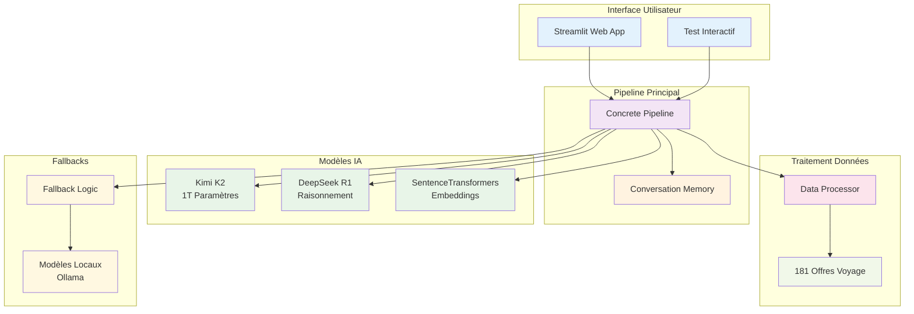
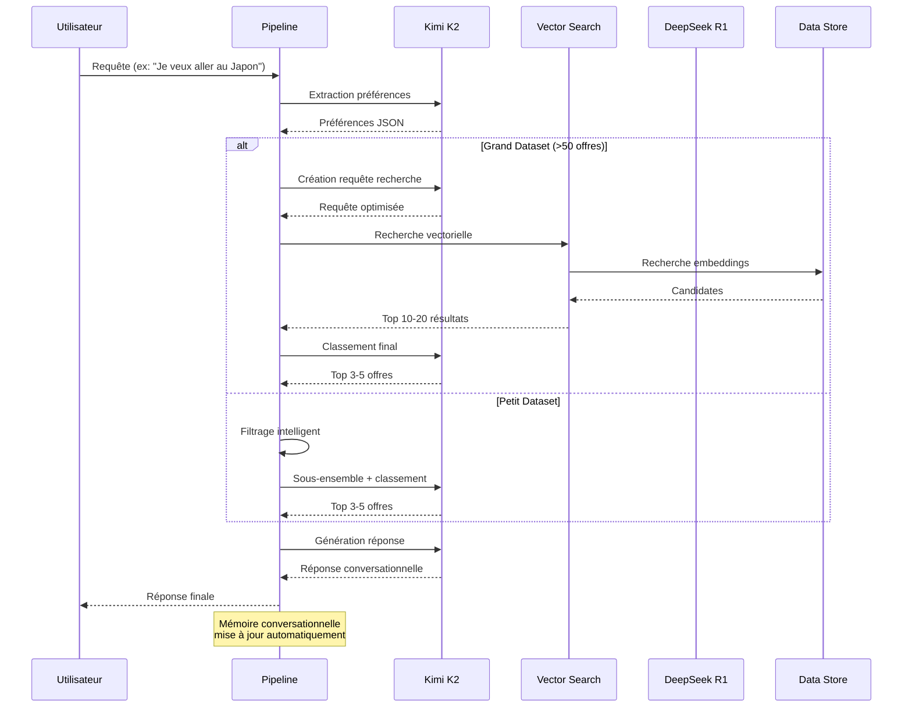

# Agent de Voyage Layla v1.0.0

Un agent de voyage intelligent alimenté par une architecture hybride LLM + Recherche Vectorielle, conçu pour aider les utilisateurs à trouver les packages de voyage parfaits à partir d'une sélection d'offres curatées.

## Fonctionnalités Principales

- **Architecture Hybride LLM + Vector Search**: Combine l'intelligence de Kimi K2 avec la recherche sémantique rapide
- **Gestion Intelligente des Tokens**: Gère les grands ensembles de données sans dépassement de tokens
- **Fallbacks Robustes**: Fonctionne même lorsque les APIs sont indisponibles
- **Mémoire Conversationnelle**: Mémorise les préférences utilisateur à travers les conversations
- **Correspondance Précise des Offres**: Plus de confusion entre les offres similaires
- **Scalabilité**: Gère de 10 à 10,000+ offres de voyage

## Architecture du Pipeline

### Workflow Principal



### Architecture Système



### Flux de Données Hybride



### Étapes du Pipeline

1. **Extraction des Préférences**: Analyse de l'entrée utilisateur pour extraire les préférences de voyage
2. **Compréhension LLM**: Utilisation de Kimi K2 pour comprendre l'intention utilisateur
3. **Recherche Vectorielle**: Recherche sémantique rapide dans la base d'offres
4. **Classement LLM**: Sélection et classement des meilleures offres par Kimi K2
5. **Génération de Réponse**: Création d'une réponse conversationnelle naturelle

## Modèles Utilisés

### Modèles Principaux

- **Kimi K2 (1T paramètres)**: Modèle principal pour la génération, la compréhension et le classement
- **DeepSeek R1**: Modèle de raisonnement pour les processus de pensée complexes
- **SentenceTransformers**: Modèle d'embeddings pour la recherche sémantique

### Configuration des Modèles

```python
# Modèle de Génération
generation_model = "moonshotai/kimi-k2-instruct"
temperature = 0.4
max_tokens = 400

# Modèle de Raisonnement
reasoning_model = "deepseek-r1-distill-llama-70b"
temperature = 0.05
max_tokens = 500

# Modèle d'Embeddings
embedding_model = "all-MiniLM-L6-v2"
```

## Hiérarchie du Projet

```
cftravel_agent/
├── concrete_pipeline.py          # Pipeline principal avec architecture hybride
├── config.py                     # Configuration des modèles et paramètres
├── llm_factory.py               # Factory pour créer les instances LLM
├── data_processor.py            # Traitement des données et gestion des offres
├── streamlit_app.py             # Interface web Streamlit
├── interactive_test.py          # Script de test interactif
├── langchain_pipeline.py        # Pipeline alternatif LangChain
├── requirements.txt             # Dépendances Python
├── README.md                    # Documentation en anglais
├── README_FR.md                 # Documentation en français
├── VERSION.md                   # Notes de version
├── LARGE_DATASET_SOLUTIONS.md   # Solutions pour grands ensembles de données
└── data/
    └── asia/
        ├── data.json            # Données des offres de voyage
        └── raw.xml              # Données brutes XML
```

## Installation et Configuration

### Prérequis

- Python 3.8+
- Clé API Groq (pour les modèles cloud)
- Modèles locaux Ollama (optionnel)

### Installation des Dépendances

```bash
pip install -r requirements.txt
```

### Configuration de l'Environnement

Créer un fichier `.env` à la racine du projet:

```env
# Configuration Groq (recommandé)
GROQ_API_KEY=votre_cle_api_groq
USE_GROQ_REASONING=true
USE_GROQ_GENERATION=true
USE_GROQ_MATCHING=true

# Configuration des Modèles
REASONING_MODEL=deepseek-r1-distill-llama-70b
GENERATION_MODEL=moonshotai/kimi-k2-instruct
MATCHING_MODEL=moonshotai/kimi-k2-instruct

# Configuration des Données
DATA_PATH=data/asia/data.json
DEBUG=false
```

### Installation d'Ollama (Optionnel)

Pour utiliser les modèles locaux:

```bash
# Installation d'Ollama
curl -fsSL https://ollama.ai/install.sh | sh

# Téléchargement des modèles
ollama pull llama2
ollama pull phi
ollama pull qwen2.5:0.5b
```

## Utilisation

### Interface Web Streamlit

```bash
streamlit run streamlit_app.py
```

### Test Interactif

```bash
python interactive_test.py
```

### Test du Pipeline

```bash
python test_pipeline.py
```

## Architecture Technique

### Pipeline Hybride

Le système utilise une approche hybride qui combine:

1. **LLM pour la Compréhension**: Analyse sémantique profonde des requêtes utilisateur
2. **Recherche Vectorielle**: Recherche rapide dans la base d'offres
3. **LLM pour le Classement**: Sélection intelligente des meilleures offres
4. **Fallbacks Robustes**: Fonctionnement même en cas de panne API

### Gestion des Tokens

- **Filtrage Intelligent**: Pré-filtrage des offres pour éviter le dépassement de tokens
- **Sous-ensembles Intelligents**: Sélection d'offres pertinentes pour l'LLM
- **Limitation Dynamique**: Adaptation automatique selon la taille des données

### Mémoire Conversationnelle

- **Préférences Persistantes**: Mémorisation des préférences utilisateur
- **Contexte Conversationnel**: Maintien du contexte à travers les interactions
- **Mise à Jour Dynamique**: Adaptation des préférences selon les nouvelles informations

## Performance et Scalabilité

### Capacités Actuelles

- **0 offres**: Fonctionnement optimal avec l'ensemble de données actuel
- **10,000+ offres**: Architecture prête pour les grands catalogues
- **1,000,000+ offres**: Solutions documentées pour les très grands ensembles

### Optimisations

- **Recherche Vectorielle**: Temps de réponse < 100ms
- **Fallbacks Intelligents**: Fonctionnement même sans APIs externes
- **Gestion Mémoire**: Optimisation pour les grands ensembles de données

## Développement

### Structure du Code

- **Modularité**: Chaque composant est indépendant et testable
- **Extensibilité**: Architecture permettant l'ajout de nouveaux modèles
- **Maintenabilité**: Code bien documenté et structuré

### Tests

```bash
# Test du pipeline complet
python interactive_test.py

# Test des composants individuels
python -c "from concrete_pipeline import ConcretePipeline; print('Import réussi')"
```

## Déploiement

### Production

Le système est prêt pour la production avec:

- **Fallbacks Robustes**: Fonctionnement même en cas de panne
- **Gestion d'Erreurs**: Traitement gracieux des erreurs
- **Monitoring**: Logs détaillés pour le debugging
- **Scalabilité**: Architecture adaptée aux charges importantes

### Environnements

- **Développement**: Configuration locale avec modèles Ollama
- **Staging**: Configuration hybride avec APIs Groq
- **Production**: Configuration optimisée pour la charge

## Support et Maintenance

### Documentation

- **README.md**: Documentation complète en anglais
- **README_FR.md**: Documentation complète en français
- **VERSION.md**: Notes de version détaillées
- **LARGE_DATASET_SOLUTIONS.md**: Solutions pour l'évolutivité

### Maintenance

- **Mises à Jour**: Compatibilité avec les nouvelles versions des modèles
- **Optimisations**: Améliorations continues des performances
- **Nouvelles Fonctionnalités**: Extension des capacités selon les besoins

## Licence

Ce projet est développé pour un usage interne et commercial.

---

**Agent de Voyage Layla v1.0.0**  
*Alimenté par l'Architecture Hybride LLM + Recherche Vectorielle* 